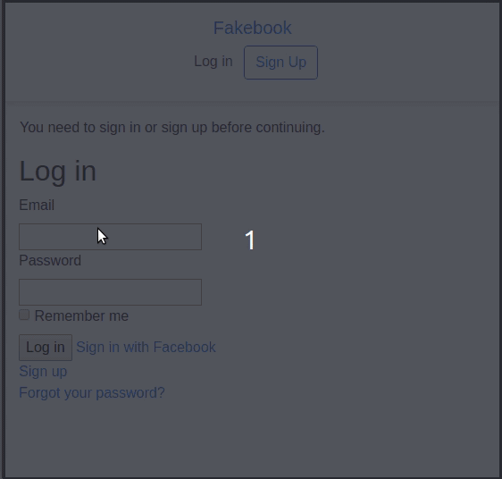

# Alternative

A social network with these functionalities: 
  - User:
    - Login.
    - SignUp.
    - Recover Password.
    - E-mail confirmation.
   - Posting.
   - Commenting.
   - Adding friends.

## Demo

## Installation

  Clone project and run:

      npm install

      bundle install

      bundle update

## Live version

[Here](https://afternoon-wave-75260.herokuapp.com/).

## Resources

[Odin Project](https://www.theodinproject.com/courses/ruby-on-rails/lessons/final-project).

## Collaborators

[Ivan Derlich](https://github.com/IvanDerlich/).

[Gabriela Cruz](https://github.com/ViriCruz/).
